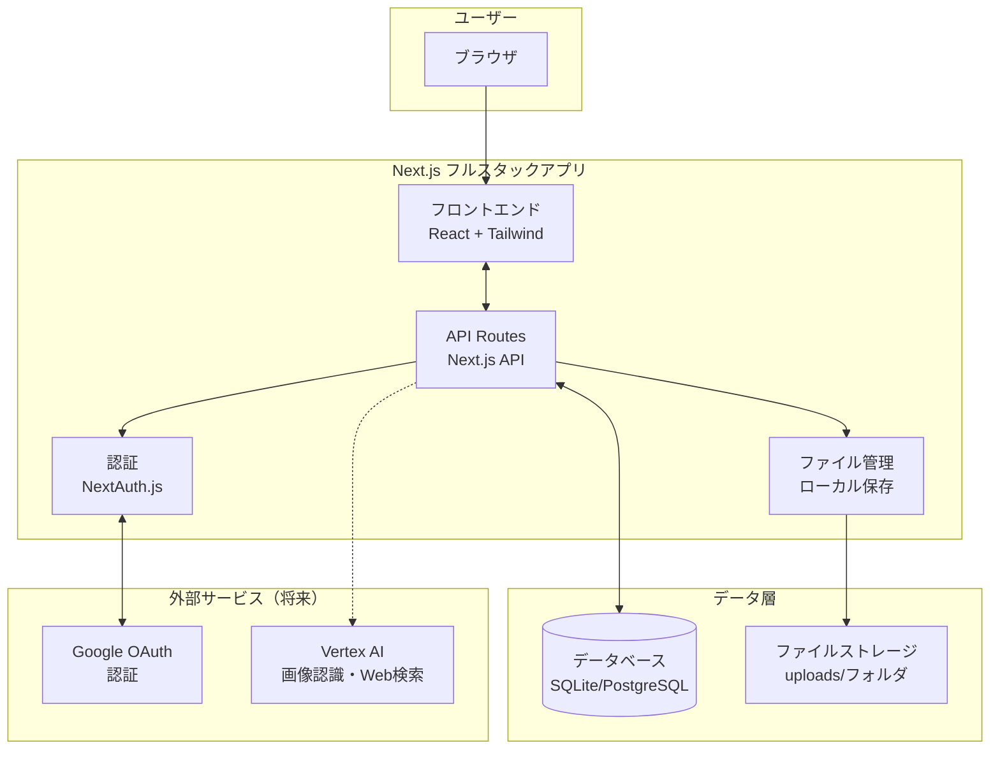
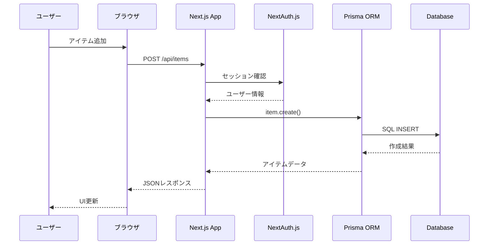
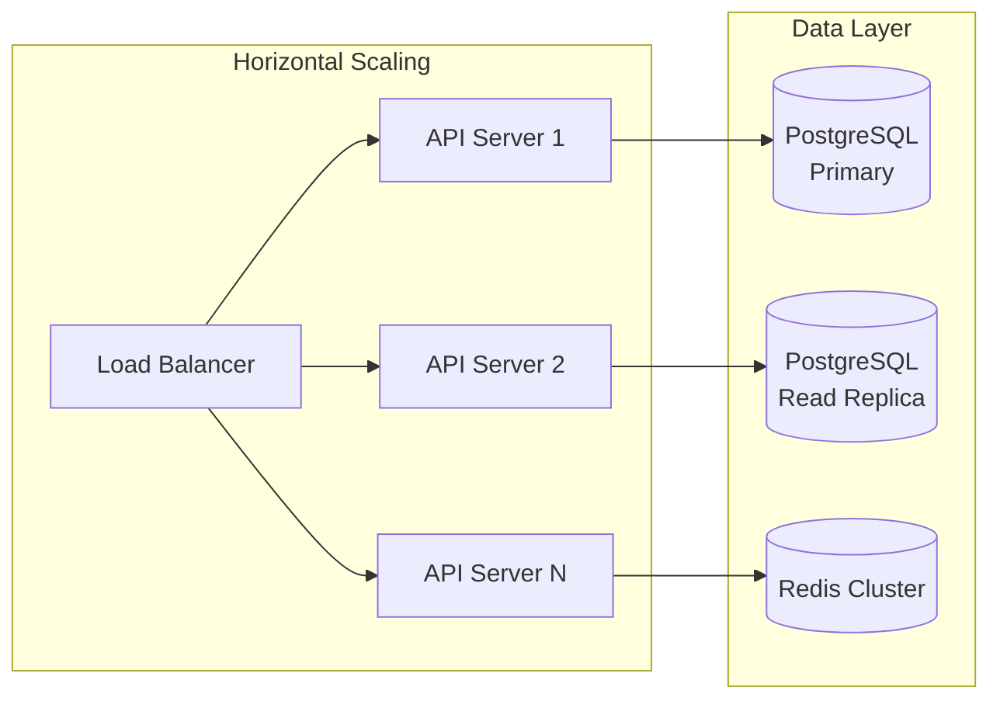

# 技術設計書

## 概要
plat-dotは、Next.jsベースのモノリシックアーキテクチャを採用した、シンプルで拡張性のあるAI機能付き個人向け持ち物管理Webアプリケーションです。1つのアプリケーションですべての機能を提供し、段階的に機能を追加しながら確実に動作確認できる設計になっています。必要に応じて将来的にマイクロサービス化も可能な柔軟な構造を保持しています。

## アーキテクチャ

### シンプルモノリシック構成



### ディレクトリ構造

```
plat-dot/
├── src/
│   ├── app/                    # App Router
│   │   ├── api/               # API Routes
│   │   │   ├── auth/          # 認証API
│   │   │   ├── items/         # アイテムAPI
│   │   │   ├── folders/       # フォルダAPI
│   │   │   └── upload/        # ファイルアップロード
│   │   ├── dashboard/         # メインUI
│   │   ├── login/             # ログインページ
│   │   └── layout.tsx         # 共通レイアウト
│   ├── components/             # Reactコンポーネント
│   └── lib/                    # 共通ライブラリ
│       ├── db.ts               # Prismaクライアント
│       ├── auth.ts             # NextAuth設定
│       └── utils.ts            # ユーティリティ
├── prisma/
│   └── schema.prisma           # 単一DBスキーマ
├── uploads/                    # ローカルファイル保存
├── public/                     # 静的ファイル
└── package.json                # 依存関係
```

## 技術スタック（最小構成）

### コア技術
- **フレームワーク**: Next.js 14.x (App Router)
- **言語**: TypeScript 5.x
- **データベース**: Prisma + SQLite(開発) / PostgreSQL(本番)
- **認証**: NextAuth.js + Google OAuth
- **UI**: Tailwind CSS
- **バリデーション**: Zod

### 依存関係（package.json）
```json
{
  "dependencies": {
    "next": "^14.0.0",
    "react": "^18.0.0",
    "typescript": "^5.0.0",
    "prisma": "^5.0.0",
    "@prisma/client": "^5.0.0",
    "next-auth": "^4.24.0",
    "@next-auth/prisma-adapter": "^1.0.7",
    "tailwindcss": "^3.4.0",
    "zod": "^3.22.0",
    "@google-cloud/aiplatform": "^3.0.0"
  },
  "devDependencies": {
    "@types/node": "^20.0.0",
    "@types/react": "^18.0.0"
  }
}
```

### 将来的な拡張オプション
- **AI機能**: Vertex AI (Gemini Pro Vision) - 画像認識と商品名推定
- **価格検索**: Vertex AI Agent Builder - Web検索統合
- **ファイルストレージ**: Cloud Storage
- **デプロイ**: Vercel / Cloud Run
- **監視**: Vercel Analytics / Cloud Monitoring

## コンポーネント設計

### API Routes（Next.js API）

```typescript
// 認証API (NextAuth.jsが自動生成)
/api/auth/[...nextauth]     # Google OAuth + セッション管理

// アイテム管理API
/api/items                  # GET: 一覧, POST: 作成
/api/items/[id]            # GET: 詳細, PUT: 更新, DELETE: 削除

// フォルダ管理API
/api/folders               # GET: 一覧, POST: 作成
/api/folders/[id]          # GET: 詳細, PUT: 更新, DELETE: 削除

// ファイルアップロードAPI
/api/upload                # POST: 画像アップロード

// 将来的なAI API (Vertex AI)
/api/ai/recognize          # POST: 画像認識 (Gemini Pro Vision)
/api/ai/search-prices      # POST: 価格検索 (Agent Builder)
```

### API実装例

```typescript
// src/app/api/items/route.ts (シンプルなCRUD)
import { auth } from '@/lib/auth'
import { prisma } from '@/lib/db'
import { NextRequest } from 'next/server'

// アイテム一覧取得
export async function GET() {
  const session = await auth()
  if (!session?.user) {
    return Response.json({ error: 'Unauthorized' }, { status: 401 })
  }

  const items = await prisma.item.findMany({
    where: { userId: session.user.id },
    include: { folder: true },
    orderBy: { createdAt: 'desc' }
  })
  
  return Response.json(items)
}

// アイテム作成
export async function POST(req: NextRequest) {
  const session = await auth()
  if (!session?.user) {
    return Response.json({ error: 'Unauthorized' }, { status: 401 })
  }

  const { name, description, folderId, imageUrl } = await req.json()
  
  const item = await prisma.item.create({
    data: {
      name,
      description,
      folderId,
      imageUrl,
      userId: session.user.id
    }
  })
  
  return Response.json(item)
}
```

### アプリケーションフロー



## エラーハンドリング

### エラー分類
```typescript
enum ErrorCode {
  // 認証エラー (401)
  UNAUTHORIZED = 'UNAUTHORIZED',
  INVALID_TOKEN = 'INVALID_TOKEN',
  TOKEN_EXPIRED = 'TOKEN_EXPIRED',
  
  // 権限エラー (403)
  FORBIDDEN = 'FORBIDDEN',
  SUBSCRIPTION_REQUIRED = 'SUBSCRIPTION_REQUIRED',
  AI_LIMIT_EXCEEDED = 'AI_LIMIT_EXCEEDED',
  
  // バリデーションエラー (400)
  VALIDATION_ERROR = 'VALIDATION_ERROR',
  INVALID_INPUT = 'INVALID_INPUT',
  FILE_TOO_LARGE = 'FILE_TOO_LARGE',
  
  // リソースエラー (404)
  NOT_FOUND = 'NOT_FOUND',
  
  // ビジネスロジックエラー (422)
  DUPLICATE_FOLDER = 'DUPLICATE_FOLDER',
  MAX_ITEMS_EXCEEDED = 'MAX_ITEMS_EXCEEDED',
  MAX_IMAGES_EXCEEDED = 'MAX_IMAGES_EXCEEDED',
  
  // 外部サービスエラー (502)
  AI_SERVICE_ERROR = 'AI_SERVICE_ERROR',
  PAYMENT_SERVICE_ERROR = 'PAYMENT_SERVICE_ERROR',
  
  // サーバーエラー (500)
  INTERNAL_ERROR = 'INTERNAL_ERROR'
}
```

### エラーレスポンス形式
```typescript
interface ErrorResponse {
  error: {
    code: ErrorCode;
    message: string;
    details?: any;
    timestamp: string;
  };
}
```

## セキュリティ対策

### 認証・認可
- JWTトークンベース認証（有効期限15分）
- Refresh Token（有効期限7日間、HttpOnly Cookie）
- CSRF対策（SameSite Cookie + CSRFトークン）
- Rate Limiting（IP/ユーザーベース）

### データ保護
- 全通信のHTTPS強制
- パスワードのbcrypt暗号化
- データベース暗号化（at rest）
- 画像URLの署名付き限定公開

### 入力検証
- Zodによる厳密な入力検証
- SQLインジェクション対策（Prisma ORM）
- XSS対策（React自動エスケープ + CSP）
- ファイルアップロード検証（MIME type、サイズ）

### アクセス制御
```typescript
// ミドルウェア例
export const requireAuth = async (req, res, next) => {
  const token = req.headers.authorization?.split(' ')[1];
  if (!token) return res.status(401).json({ error: 'Unauthorized' });
  
  try {
    const payload = jwt.verify(token, JWT_SECRET);
    req.user = await getUserById(payload.userId);
    next();
  } catch (error) {
    res.status(401).json({ error: 'Invalid token' });
  }
};

export const requireSubscription = (tier: 'free' | 'premium') => {
  return (req, res, next) => {
    if (req.user.subscription_tier !== tier) {
      return res.status(403).json({ error: 'Subscription required' });
    }
    next();
  };
};
```

## パフォーマンス・スケーラビリティ

### キャッシング戦略
- Redis キャッシュ層
  - ユーザーセッション（TTL: 24時間）
  - アイテムリスト（TTL: 5分）
  - 価格データ（TTL: 1時間）
  - AI認識結果（TTL: 7日）

### 最適化手法
- 画像の遅延読み込み（Intersection Observer）
- 仮想スクロール（大量アイテム表示）
- 画像のリサイズ・最適化（Sharp）
- データベースインデックス最適化
- N+1クエリ問題の回避

### スケーリング対策


## テスト戦略

### テストピラミッド
```
         /\
        /E2E\      (10%) - Playwright
       /------\
      /統合テスト\   (30%) - Supertest + DB
     /----------\
    /ユニットテスト\  (60%) - Jest + Testing Library
   /--------------\
```

### テスト種別
1. **ユニットテスト**
   - ビジネスロジック
   - Reactコンポーネント
   - ユーティリティ関数
   - カバレッジ目標: 80%

2. **統合テスト**
   - APIエンドポイント
   - データベース操作
   - 外部サービス連携（モック使用）

3. **E2Eテスト**
   - 主要ユーザーフロー
   - クリティカルパス
   - クロスブラウザテスト

### テスト環境
```typescript
// テスト設定例
export const testConfig = {
  database: {
    url: process.env.TEST_DATABASE_URL,
    reset: true, // 各テスト前にリセット
  },
  redis: {
    url: process.env.TEST_REDIS_URL,
    flushAll: true,
  },
  mocks: {
    vertexai: true,
    stripe: true,
    email: true,
  },
};
```

## 段階的実装計画（シンプル版）

### Week 1: プロジェクトセットアップ
**目標**: 基盤環境と認証の実装

```bash
# プロジェクト作成
npx create-next-app@latest plat-dot --typescript --tailwind --app
cd plat-dot

# 基本依存関係
npm install prisma @prisma/client next-auth @next-auth/prisma-adapter zod

# 開発用依存関係
npm install -D @types/node jest @testing-library/react

# Prismaセットアップ
npx prisma init --datasource-provider sqlite
```

**確認項目**:
✅ Next.jsアプリが起動する  
✅ Google OAuthログインが動作する  
✅ データベース接続が成功する  
✅ ユーザー情報が表示される

### Week 2: アイテム管理CRUD + AI機能基盤
**目標**: アイテムの基本操作とVertex AI基盤を完成

```typescript
// src/app/api/items/route.ts
export async function GET() {
  const session = await auth()
  if (!session?.user) {
    return Response.json({ error: 'Unauthorized' }, { status: 401 })
  }

  const items = await prisma.item.findMany({
    where: { userId: session.user.id },
    orderBy: { createdAt: 'desc' }
  })
  
  return Response.json(items)
}

// src/lib/vertexai.ts
import { VertexAI } from '@google-cloud/aiplatform'

const vertex_ai = new VertexAI({
  project: process.env.GOOGLE_CLOUD_PROJECT,
  location: process.env.VERTEX_AI_LOCATION || 'asia-northeast1'
})

export async function recognizeImage(imageBase64: string): Promise<string[]> {
  const model = vertex_ai.preview.getGenerativeModel({ model: 'gemini-pro-vision' })
  
  const request = {
    contents: [{
      role: 'user',
      parts: [
        { text: 'この画像の商品名を3つまで提案してください' },
        { inline_data: { mime_type: 'image/jpeg', data: imageBase64 } }
      ]
    }]
  }
  
  const response = await model.generateContent(request)
  const text = response.response.candidates[0].content.parts[0].text
  
  // AIの回答から商品名候補を抽出
  return text.split('\n').filter(line => line.trim()).slice(0, 3)
}
```

**確認項目**:
✅ アイテム作成ができる  
✅ アイテム一覧が表示される  
✅ アイテム編集ができる  
✅ アイテム削除ができる  
✅ 認証チェックが動作する  
✅ Vertex AI接続が成功する  
✅ 画像認識APIが動作する

### Week 3: フォルダ管理

**目標**: フォルダ機能とアイテム組織化

```typescript
// src/app/api/folders/route.ts
export async function POST(req: NextRequest) {
  const session = await auth()
  if (!session?.user) {
    return Response.json({ error: 'Unauthorized' }, { status: 401 })
  }

  const { name, description, parentId } = await req.json()
  
  const folder = await prisma.folder.create({
    data: {
      name,
      description,
      parentId,
      userId: session.user.id
    }
  })
  
  return Response.json(folder)
}
```

**確認項目**:
✅ フォルダ作成ができる  
✅ フォルダ階層表示ができる  
✅ アイテムのフォルダ移動ができる  
✅ フォルダ内アイテム一覧が表示される

### Week 4: 画像アップロード
**目標**: ファイルアップロード機能を実装

```typescript
// src/app/api/upload/route.ts
export async function POST(req: NextRequest) {
  const session = await auth()
  if (!session?.user) {
    return Response.json({ error: 'Unauthorized' }, { status: 401 })
  }

  const formData = await req.formData()
  const file = formData.get('file') as File
  
  if (!file) {
    return Response.json({ error: 'No file provided' }, { status: 400 })
  }

  // ファイル検証
  validateFile(file)
  
  // ファイル保存
  const fileName = `${Date.now()}-${file.name}`
  const buffer = Buffer.from(await file.arrayBuffer())
  await writeFile(path.join('./uploads', fileName), buffer)
  
  return Response.json({ url: `/uploads/${fileName}` })
}
```

**確認項目**:
✅ 画像アップロードができる  
✅ アップロードした画像が表示される  
✅ ファイルサイズ制限が動作する  
✅ ファイル形式検証が動作する

### Cloud Build CI/CD

```yaml
# cloudbuild.yaml
steps:
  # テスト実行
  - name: 'node:20'
    entrypoint: 'npm'
    args: ['test']
    
  # Dockerイメージビルド
  - name: 'gcr.io/cloud-builders/docker'
    args: ['build', '-t', 'gcr.io/$PROJECT_ID/auth-service', '-f', 'services/auth/Dockerfile', '.']
    
  # Container Registryにプッシュ
  - name: 'gcr.io/cloud-builders/docker'
    args: ['push', 'gcr.io/$PROJECT_ID/auth-service']
    
  # Cloud Runにデプロイ
  - name: 'gcr.io/google.com/cloudsdktool/cloud-sdk'
    entrypoint: 'gcloud'
    args:
    - 'run'
    - 'deploy'
    - 'auth-service'
    - '--image'
    - 'gcr.io/$PROJECT_ID/auth-service'
    - '--region'
    - 'asia-northeast1'
    - '--platform'
    - 'managed'
    - '--allow-unauthenticated'

options:
  machineType: 'E2_HIGHCPU_8'
  
timeout: '1200s'
```

### Secret Manager 連携

```bash
# Secret作成
gcloud secrets create database-url --data-file=database-url.txt
gcloud secrets create jwt-secret --data-file=jwt-secret.txt
gcloud secrets create google-cloud-project-id --data-file=project-id.txt

# Cloud RunサービスアカウントにSecretアクセス権限付与
gcloud secrets add-iam-policy-binding database-url \
    --member="serviceAccount:auth-service@PROJECT_ID.iam.gserviceaccount.com" \
    --role="roles/secretmanager.secretAccessor"
```

### Cloud SQL Proxy 設定

```typescript
// src/config/database.ts
import { createConnection } from '@google-cloud/sql-proxy'

const createDatabaseConnection = async () => {
  if (process.env.NODE_ENV === 'production') {
    // Cloud SQL Proxyを使用
    const connection = await createConnection({
      instanceConnectionName: process.env.INSTANCE_CONNECTION_NAME!,
      ipType: 'PRIVATE', // VPC内通信
    })
    
    return {
      host: connection.host,
      port: connection.port,
      database: process.env.DB_NAME,
      username: process.env.DB_USER,
      password: process.env.DB_PASSWORD,
      ssl: {
        rejectUnauthorized: false
      }
    }
  }
  
  // ローカル開発用
  return {
    host: 'localhost',
    port: 5432,
    database: 'platdot_dev',
    username: 'dev_user',
    password: 'dev_password'
  }
}
```

### Week 5-6: UI/UX完成

**目標**: 使いやすいUIとレスポンシブデザイン

```tsx
// src/app/dashboard/page.tsx
'use client'
import { useState, useEffect } from 'react'
import { useSession } from 'next-auth/react'

export default function Dashboard() {
  const { data: session } = useSession()
  const [items, setItems] = useState([])
  const [folders, setFolders] = useState([])

  useEffect(() => {
    if (session) {
      fetchItems()
      fetchFolders()
    }
  }, [session])

  const fetchItems = async () => {
    const response = await fetch('/api/items')
    const data = await response.json()
    setItems(data)
  }

  if (!session) {
    return <div>ログインが必要です</div>
  }

  return (
    <div className="container mx-auto p-4">
      <h1 className="text-2xl font-bold mb-6">持ち物管理</h1>
      
      {/* アイテム一覧 */}
      <div className="grid grid-cols-1 md:grid-cols-2 lg:grid-cols-3 gap-4">
        {items.map(item => (
          <ItemCard key={item.id} item={item} />
        ))}
      </div>
      
      {/* アイテム追加フォーム */}
      <AddItemForm onAdd={fetchItems} />
    </div>
  )
}
```

**確認項目**:
✅ レスポンシブデザインが動作する  
✅ アイテムカード表示が美しい  
✅ フォームのバリデーションが動作する  
✅ ローディング状態が表示される

### Week 7-8: テストとデプロイ
**目標**: テスト追加と本番環境デプロイ

```typescript
// __tests__/api/items.test.ts
import { GET, POST } from '@/app/api/items/route'

describe('/api/items', () => {
  it('認証されたユーザーのアイテム一覧が取得できる', async () => {
    // テスト実装
  })
  
  it('未認証ユーザーは401エラーが返る', async () => {
    // テスト実装
  })
})
```

**確認項目**:
✅ 単体テストが通る  
✅ E2Eテストが通る  
✅ Vercelデプロイが成功する  
✅ 本番環境で動作する

## 将来拡張計画

### Phase 2: AI機能追加（3-4ヶ月後）

- **画像認識**: Vertex AI (Gemini Pro Vision)連携
- **価格検索**: メルカリ等のAPI連携
- **AI結果キャッシュ**: Redis導入

```typescript
// src/app/api/ai/recognize/route.ts
import { recognizeImage } from '@/lib/vertexai'

export async function POST(req: NextRequest) {
  const session = await auth()
  if (!session?.user) {
    return Response.json({ error: 'Unauthorized' }, { status: 401 })
  }

  const { imageBase64 } = await req.json()
  
  try {
    // Vertex AI Gemini Pro Vision呼び出し
    const suggestions = await recognizeImage(imageBase64)
    
    return Response.json({
      success: true,
      suggestions,
      confidence: 0.85 // Vertex AIから信頼度も取得可能
    })
  } catch (error) {
    console.error('AI recognition failed:', error)
    return Response.json({
      success: false,
      error: 'AI認識に失敗しました'
    }, { status: 500 })
  }
}
```

### Phase 3: スケーリング対応（6-12ヶ月後）

- **マイクロサービス化**: 必要に応じて分離
- **GCP Cloud Run**: 本格スケーリング
- **グローバル対応**: 多言語・多通貨

**コスト見積もり**:
- **MVP段階**: Vercel Hobby ($0) + DB ($5-10/月)
- **AI機能段階**: $20-50/月
- **本格運用**: $100-500/月

## メリットまとめ

### シンプルモノリシックの利点
✅ **開発速度**: 10分でコーディング開始  
✅ **学習コスト**: Next.js + Prismaのみ習得  
✅ **デバッグ**: 1つのアプリで完結  
✅ **デプロイ**: Vercelに1クリック  
✅ **コスト**: 初期は$0から開始  
✅ **拡張性**: 必要時にマイクロサービス化可能  

### 適用ケース
- **MVP開発**: 素早く動作するものを作りたい
- **個人プロジェクト**: 1人で管理しやすい
- **学習目的**: 最新技術を習得したい
- **コスト重視**: 初期コストを抑えたい

**Phase 1 終了条件**: 
- 各Cloud Runサービスが独立でスケーリング可能
- Cloud Load Balancerで統一アクセスポイント提供
- Cloud Monitoringで全サービスのヘルス状態監視
- ユーザーの基本的なアイテム管理が完全動作
- 月額コスト$50以下で運用可能（小規模用途）

### Phase 2: AI Services (GCP AI サービス統合)
**目標**: Vertex AI + OpenAIでスケーラブルAI機能実現

#### 2.1 Recognition Service (Cloud Run + Vertex AI)
- Vertex AI (Gemini Pro Vision) 単一構成でシンプル化
- Cloud Memorystore（Redis）で結果キャッシュ
- **Cloud Run設定**: CPU 2, Memory 2Gi（AI処理用）
- **コスト最適化**: リクエスト毎にインスタンス起動（コールドスタート容許）
- **コスト見積もり**: Vertex AI入力1000画像で約$3-5（OpenAIの約1/10）
- **テスト内容**: Vertex AIモック + 実環境コストテスト

#### 2.2 Price Search Service (Cloud Functions)
- Cloud FunctionsでPuppeteerスクレイピング実行
- コールドスタートでコスト最適化（使用時のみ課金）
- Cloud Schedulerで定期実行スケジューリング
- **メモリ**: 1GB（Chromeヘッドレスブラウザ用）
- **タイムアウト**: 540秒（最大実行時間）
- **テスト内容**: Functions Frameworkでローカルテスト + 本番環境テスト

#### 2.3 Cloud Pub/Sub 連携
- Cloud Pub/Subで非同期メッセージング
- Push SubscriptionでCloud Runサービスに自動配信
- Dead Letter Queueでエラーハンドリング
- **メッセージ保持**: 7日間（障害時の再処理用）
- **テスト内容**: Pub/Sub Emulatorでメッセージフローテスト

**Phase 2 終了条件**:
- AI機能がGCPネイティブサービスと統合して動作
- Vertex AI単一構成でコスト最適化とシンプル化を実現
- Cloud Functionsでスクレイピングコストを実行時のみに最適化
- AI障害時でもコア機能は継続利用可能
- 月額AIコスト$50以下で運用可能（Vertex AI化により大幅削減）

### Phase 3: Business Services (GCPエンタープライズ機能)
**目標**: スケール可能な商用サービスとエンタープライズ機能

#### 3.1 Subscription Service
- Stripe統合
- AI使用制限管理
- **独立テスト**: Stripeモックで課金ロジックテスト

#### 3.2 Price Tracking Service
- 定期価格追跡
- Price Search Serviceと連携
- **独立テスト**: スケジューラーロジックテスト

#### 3.3 Notification Service
- 価格変動通知
- メール/プッシュ通知
- **独立テスト**: 通知ロジックの単体テスト

### サービス別テスト戦略

#### 単体テスト（各サービス内）
```typescript
// 例: Item Serviceの単体テスト
describe('Item Service', () => {
  beforeEach(() => {
    // Auth Serviceをモック
    mockAuthService.verifyToken = jest.fn().mockResolvedValue({userId: 'test-user'})
  })
  
  it('アイテム作成が成功する', async () => {
    const item = await itemService.createItem('user1', {name: 'test-item'})
    expect(item.name).toBe('test-item')
  })
})
```

#### 統合テスト（サービス間連携）
```typescript
// 例: Item + File Serviceの統合テスト
describe('Item with File Integration', () => {
  it('アイテム作成時に画像も保存される', async () => {
    // 実際File Serviceと通信してテスト
    const fileUrl = await fileService.uploadFile(imageBuffer)
    const item = await itemService.createItem('user1', {name: 'test', imageUrl: fileUrl})
    expect(item.imageUrl).toBe(fileUrl)
  })
})
```

#### E2Eテスト（シナリオベース）
```typescript
// 例: アイテム作成からAI認識までのフロー
describe('E2E: Item Creation with AI', () => {
  it('画像付きアイテム作成から商品名認識まで', async () => {
    // 1. ユーザーログイン
    const token = await login(testUser)
    
    // 2. 画像アップロード
    const fileUrl = await uploadImage(imageFile, token)
    
    // 3. アイテム作成
    const item = await createItem({name: 'temp', imageUrl: fileUrl}, token)
    
    // 4. AI認識リクエスト
    const recognitionId = await requestRecognition(item.id, token)
    
    // 5. 認識結果取得
    const result = await getRecognitionResult(recognitionId, token)
    
    expect(result.suggestions).toHaveLength(3)
  })
})
```

### GCP Cloud Runメリットまとめ

1. **サーバーレスススケーリング**: リクエスト数に応じて自動スケーリング（0→N）
2. **コスト最適化**: 使用時間分のみ課金、アイドル時はコストゼロ
3. **管理されたインフラ**: サーバー管理不要、セキュリティ更新自動
4. **CI/CD統合**: Cloud Buildで簡単デプロイメント
5. **GCPエコシステム**: 他GCPサービスとのネイティブ統合
6. **グローバルスケール**: Cloud CDN + Load Balancerで世界展開対応
7. **監視・ログ統合**: Cloud Monitoring/Loggingでオプショナビリティ向上

### コスト見積もり（月額）
- **Phase 1**: $30-50（小規模用途）
- **Phase 2**: $50-80（AI機能追加、Vertex AI統一でコスト最適化）  
- **Phase 3**: $150-350（商用サービス）
- **スケーリング時**: 使用量に比例して線形増加

### Vertex AI統一構成のメリット
- **コスト削減**: 従来のマルチベンダー構成の約1/5のコスト
- **GCP統合**: ネイティブサービス連携で運用簡素化
- **統一管理**: 単一のサービスアカウントで全AI機能を管理
- **レイテンシ向上**: asia-northeast1リージョンで日本国内通信
- **セキュリティ**: VPC内完結、IAMによる細かなアクセス制御
- **機能統合**: 画像認識からWeb検索まで一貫したAI体験